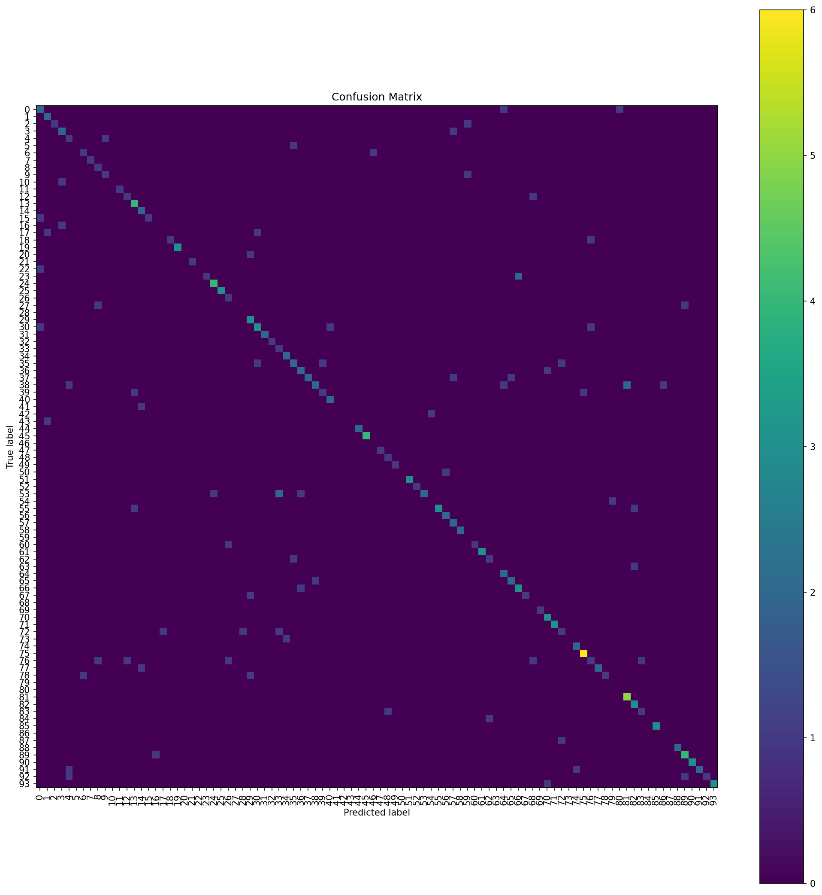
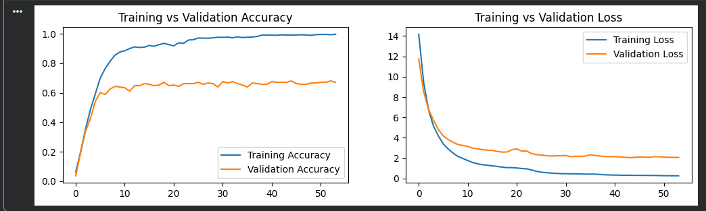

# 🐦 Bird Sound Classification

A convolutional neural network that classifies bird species from audio recordings of their calls, built with TensorFlow and librosa.

## Overview

This project extracts MFCC (Mel-Frequency Cepstral Coefficient) features from bird vocalization audio clips and trains a 1D CNN to classify each clip into one of **114 bird species**. The pipeline covers the full workflow: audio preprocessing, feature extraction, model training with regularization and adaptive learning rate scheduling, and per-class evaluation.

## Results

| Metric | Score |
|---|---|
| Test Accuracy | **65.4%** |
| Test Loss | 2.12 |
| Weighted F1-score | 0.64 |
| Macro F1-score | 0.55 |

For context: random guessing across 114 classes would score ~0.9% accuracy, so this represents strong learned signal from audio features alone.

**A note on class imbalance:** the dataset has a highly uneven number of clips per species — some species have only a handful of recordings. With a 10% test split, many classes end up with just 1–3 test samples, which is why per-class precision/recall in the full classification report swings between 0.0 and 1.0 for the rarest classes (a single misclassification on a 1-sample class shows up as 0% recall). The weighted average (0.64 F1) is the more representative number for overall performance; the macro average (0.55 F1) reflects how much the sparsest classes drag down the unweighted mean.

The training curves show the model reaching ~99% training accuracy while validation accuracy plateaus around 65–68%, with `EarlyStopping` halting training once validation loss stopped improving (~epoch 44 of a 100-epoch budget). This gap is consistent with the low per-species sample counts described above rather than a tuning failure — see **Future Work** below for how to close it.




## Approach

1. **Feature extraction** — each audio clip is loaded with `librosa`, and 40 MFCC coefficients are extracted and mean-pooled across time into a fixed-length feature vector.
2. **Data pipeline** — features are shuffled and split into train/validation/test sets (80/10/10) using `tf.data`, with shuffling applied *before* batching to ensure each batch contains a representative mix of species.
3. **Model** — a 3-block 1D CNN (Conv1D → BatchNorm → MaxPool, filters: 128/256/256) followed by two dense layers with L2 regularization and dropout, ending in a 114-way softmax.
4. **Training** — Adam optimizer (lr=1e-3), `sparse_categorical_crossentropy` loss, with `EarlyStopping`, `ModelCheckpoint`, and `ReduceLROnPlateau` callbacks.
5. **Evaluation** — overall accuracy plus per-class `classification_report` and confusion matrix, since aggregate accuracy alone is misleading across 114 imbalanced classes.

## Files
- `bird_sound_classification.ipynb` – main notebook (data pipeline, training, evaluation, prediction)
- `presentation/` – project presentation PDF
- `data/` – placeholder for the dataset (see below)
- `models/` – saved model + class-index mapping
- `requirements.txt` – dependencies

## Dataset

[Kaggle: Sound of 114 Bird Species](https://www.kaggle.com/datasets/soumendraprasad/sound-of-114-species-of-birds-till-2022)

## Running it

[](https://colab.research.google.com/github/kavi2457/Bird_Sound_Classification/blob/main/bird_sound_classification.ipynb)

1. Open the notebook in Colab (badge above) with a GPU runtime.
2. Add your Kaggle API token as a Colab secret named `KAGGLE_API_TOKEN` (Kaggle → Settings → API Tokens → Generate New Token).
3. Run all cells — the notebook downloads the dataset, extracts features, trains the model, and evaluates it end-to-end.

```bash
pip install -r requirements.txt
```

## Future Work

- **Preserve temporal structure**: currently each clip is mean-pooled into a single 40-value vector, discarding the time axis. Feeding the full 2D MFCC matrix (time × coefficients) into a Conv2D architecture would likely close much of the train/validation gap and improve accuracy on species with distinctive call rhythms.
- **Data augmentation**: pitch shifting, time stretching, and background noise injection would help the many low-sample-count species generalize better.
- **Stratified k-fold cross-validation**: given how few test samples some species get in a single 80/10/10 split, k-fold would give more reliable per-class metrics.
